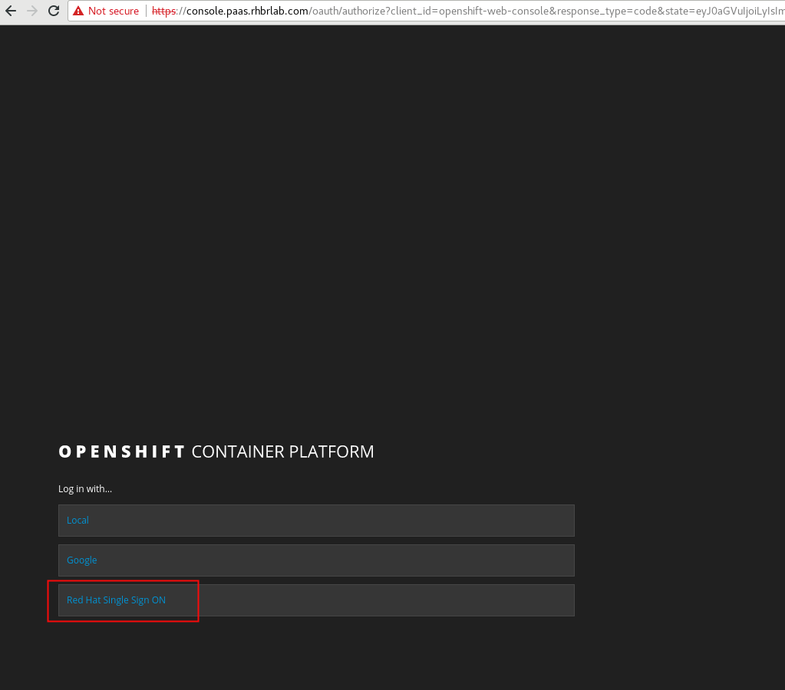

# 2.1.1 - Acesso ao ambiente

## 2.1.1.1 Acesso ao ambiente Openshift Local

Siga os passos abaixo caso o instrutor te solicite uma instalação local do Openshift na sua VM.

* Garanta que os pacotes necessários estão instalados

```text
yum install centos-release-openshift-origin37 origin-clients -y
```

Agora altere o arquivo `/etc/sysconfig/docker` e adicione `--insecure-registry 172.30.0.0/16` no fim da linha `OPTIONS=` conforme mostra imagem abaixo:


Ou se preferir, rode o comando abaixo:

```text
sed -i 's/--signature-verification=false/--signature-verification=false --insecure-registry 172.30.0.0\/16/' /etc/sysconfig/docker
```

Reinicie o Docker Daemon

```text
systemctl restart docker
```

* Executem o comando abaixo:

```text
oc cluster up \
  --public-hostname=<seu ip público> \
  --host-data-dir=/var/lib/origin/openshift.local.etcd \
  --host-config-dir=/var/lib/origin/openshift.local.config \
  --host-pv-dir=/var/lib/origin/openshift.local.pv \
  --metrics \
  --version=v3.7.0 \
  --use-existing-config
```

Altera o valor do parametro `--public-hostname` para o seu ip público caso esteja executando sua VM na Cloud.

> Caso não encontre o endereço IP da sua VM peça ajuda ao instrutor.

Nessa versão do cluster up existe um bug nas métricas. Para corrigi-lo, crie um playbook:

```text
cat <<EOF > fix.yml
- name: Fix Metrics
  hosts: 127.0.0.1
  connection: local
  tasks:
    - name: OpenShift Login
      shell: oc login -u system:admin --insecure-skip-tls-verify

    - name: Get Metrics Error Pod
      shell: oc get pods -n openshift-infra | grep Error | head -n1 | cut -d' ' -f1
      register: metrics_pod
      until: metrics_pod.stdout != ""
      retries: 20
      delay: 30

    - name: Fix Metrics Deployment
      shell: >
        oc debug "{{ metrics_pod.stdout }}" -n openshift-infra -- /usr/bin/bash -c "sed -i 's/- include: validate_hostnames.yml/#- include: validate_hostnames.yml/' /usr/share/ansible/openshift-ansible/playbooks/common/openshift-cluster/std_include.yml &&  ansible-playbook -i /tmp/inventory playbooks/byo/openshift-cluster/openshift-metrics.yml"
EOF
```

E execute-o:

```text
ansible-playbook fix.yml
```

> **NOTA:** a execução desse playbook pode demorar alguns minutos. Deixe o comando rodando e siga com os próximos passos

### 2.1.1.1.1 Acessando a Web Console

Se os passos anteriores foram executados com sucesso, você terá uma tela com a seguinte informação:


1. Esse é a url de acesso para a Web Console
2. Suas credenciais para acesso ao Openshift
3. Usuário com privilégio elevado para tarefas administrativas do cluster

## 2.1.1.2 Acesso ao ambiente OpenShift na Nuvem

> **Este passo só é necessário caso o instrutor decida usar um ambiente Openshift comartilhado! Antes de executar os passos abaixo, consulte o instrutor.**

1. Acesse a url: [https://console.paas.rhbrlab.com/console/](https://console.paas.rhbrlab.com/console/)
2. Faça o login através da opção **Red Hat Single Sign ON**



1. * informe as credenciais de acordo com o login designado pelo instrutor
   * altere sua senha no primeiro login 
2. No menu superior direito clique no ícone de ajuda e selecione a opção "**Command Line Tools**"
3. Copie o comando gerado "`oc login..`.". \(clique no botão no final do campo\) O seu token de acesso já estará nessa string.
4. Cole a linha de comando no seu terminal conforme exemplo abaixo

```text
oc login https://console.paas.rhbrlab.com --token=fkjaflowruwwoeuwourwori....................
```

**No fim do procedimento deverá aparecer a mensagem "Login success".**

Neste momento você já estará dentro do seu projeto.

A sua tela será semelhante a essa:


Esse nome destacado na imagem acima, é o `Display Name`do seu projeto. Na prática é um nome mais amigável.

Precisaremos usar o nome do seu projeto \(que não é o display name\) para várias operações nos labs posteriores. Para descobrir esse nome, basta ver um pequeno nome abaixo do display name conforme mostra a imagem abaixo:


O nome do seu projeto também pode ser visto pela linha de comando:

```text
oc get projects
```


Se você precisar ver os dados do seu projeto, basta clicar no menu de projetos conforme imagem abaixo:


## Throubleshooting

Caso tenha algum problema tentando subir o Openshift usando `oc cluster up`. Execute os passos abaixo para subir novamente:

```text
oc cluster down
systemctl stop docker
rm -rf /var/lib/origin
rm -rf ~/.kube
systemctl start docker
```

Agora execute o mesmo comando descrito no item **2.1.1.1**

