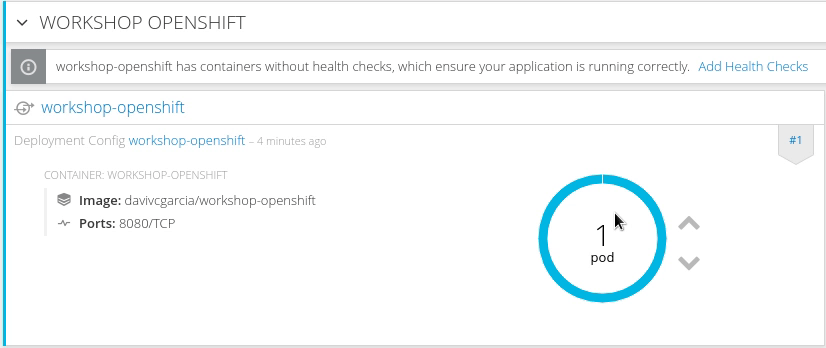
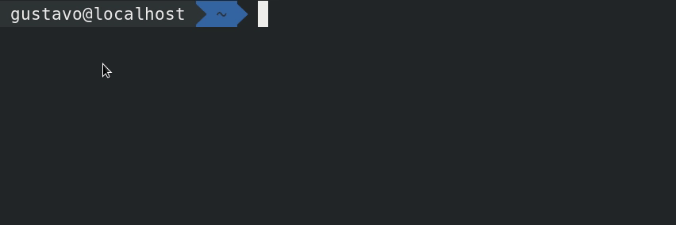
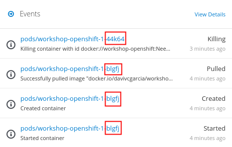

# 2.1.4 - Tolerância a falhas

O Openshift garante que a quantidade de instâncias \(PODs\) definidas para uma aplicação seja respeitada. O responsável por fazer este controle é o Replication Controller.

Neste laboratório vamos testar esse recurso.

## Scale up

Selecione a seta para cima na lateral do pod, escalando para 2 pods no total.



Enquanto o círculo estiver na cor cinza, indica que está sendo provisionado.

Quando o círculo estiver colorido de azul significa que o novo foi corretamente provisionado e já está pronto para receber novas requisições.

> Estes novos PODs são imediatamente incluídos no balanceamento de carga. Se estiver  
> usando o browser para testar o balanceamento certifique-se de apagar o cookie pois este  
> é utilizado para afinidade de sessão \(sticky session\).

## Garantia do número de réplicas

Para testar o comportamento vamos deletar um POD em execução, o intuito é simular uma falha.



1. Selecione um dos pods, no menu superior direito selecione a opção _Actions_ &gt; _Delete_ e confirme a operação.
2. Selecione a opção _Overview_ no menu lateral esquerdo e veja que um novo pod será recriado.

> Este comportamento evita aquele caso clássico de precisar ligar para alguém de operações para reiniciar a aplicação em um caso de falha

Quando o POD é deletado, o Openshift o recupera automaticamente como pode ser visto no video abaixo. Nesse exemplo, um POD novo é criado \(cor azul claro\) e outro está sendo finalizado \(cor azul escuro\) mas sempre mantendo a quantidade de 2 instâncias rodando.


Também podemos deletar um POD usando a linha de comando:

```text
oc delete po <nome do pod>
```


Na tela de monitoramento, também é refletido que um container foi eliminado e outro foi criado para substituir o antigo. Veja:



Repare que o ID do container mudou pois foi realizada uma nova criação de POD.

## Limpeza do ambiente

Agora podemos apagar essa aplicação já que não a utilizaremos mais. O comando abaixo executa essa limpeza:

```text
oc delete all -l app=workshop-openshift -n <nome do seu projeto do openshift>
```


Ao fim desse lab, sua tela do Openshift deve estar conforme imagem abaixo:


