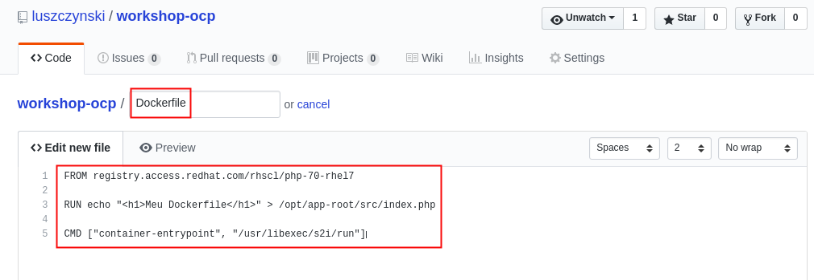
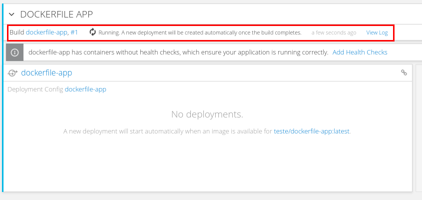
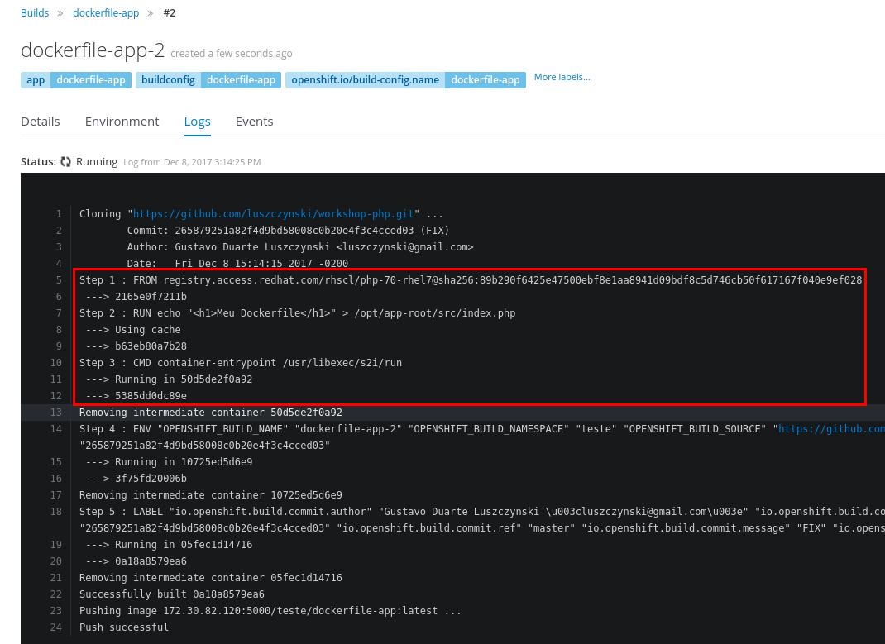

# 2.1.6 - Usando Dockerfile

Além do Source to Image, o Openshift permite realiza o build de `Dockerfile` para você. Basta adicionar o seu `Dockerfile`em um repositório git e informar ao Openshift que iremos utilizar a estratégia de build do tipo docker. Para esse exemplo, iremos **utilizar o mesmo repositório criado no lab anterior** conforme exemplo abaixo**:**

```text
https://github.com/<usuario-do-github>/workshop-ocp.git
```

## Criando nosso Dockerfile

Vamos criar um Dockerfile com base na [imagem oficial do PHP para Openshift](https://access.redhat.com/containers/#/registry.access.redhat.com/rhscl/php-70-rhel7). É importante salientar que, existem boas práticas na construção de [imagens Docker](https://docs.openshift.com/container-platform/3.11/creating_images/guidelines.html#general-container-image-guidelines) e também em[ imagens para o Openshift](https://docs.openshift.com/container-platform/3.11/creating_images/guidelines.html#openshift-specific-guidelines).

Abaixo segue o conteúdo do arquivo:

```text
FROM registry.access.redhat.com/rhscl/php-70-rhel7

RUN echo "<h1>Meu Dockerfile</h1>" > /opt/app-root/src/index.php

CMD ["container-entrypoint", "/usr/libexec/s2i/run"]
```


O conteúdo do arquivo fica assim:

> Repare que o nome do arquivo deve ser `Dockerfile` com o **D** maiúsculo.



Realize o commit


Nosso repositório agora tem um novo arquivo:


Também podemos salvar esse arquivo com nome de **Dockerfile** na raiz do nosso git executando:

```bash
git add Dockerfile
git commit -m "Dockerfile adicionado"
git push
```

## Executando o Dockerfile com Openshift

Para criar uma aplicação com base no Dockerfile, precisamos executar o seguinte comando:

```bash
oc new-app \
 --name=app-dockerfile \
 --strategy=docker \
 https://github.com/<usuario-do-github>/workshop-ocp.git
```

Para saber o nome do seu projeto no Openshift, basta executar:

```text
oc get projects
```

O valor default para o parametro **strategy** é **source.** Isso indica que, por padrão, o Openshift irá analisar o repositório git tentando compilar o código fonte da aplicação e usar o source-to-image. No nosso caso, queremos que ele use somente o Dockerfile e ignore o código fonte. Por isso informamos o parametro **--strategy=docker**

Assim que executamos o comando, o Openshift inicia o novo build.

Na versão 3.11 do Openshift, o build é mostrado conforme imagem abaixo:



A diferença desse build para o source-to-image executando anteriormente, é que nesse caso o Openshift está construindo nossa imagem Docker usando Dockerfile. Se acessarmos o log do build, podemos ver ae execução do nosso código.

Para acessar o log: Build &gt; app-dockerfile &gt; View Log.



Para finalizar, crie uma rota no Openshift para podermos acessar nossa aplicação:

```text
oc expose svc app-dockerfile
```

Esse comando expõe o seu app, criando uma rota para o mesmo. A url gerada pode ser conferida em Applications &gt; Routes


Acesse a url disponibilizada para acessar a aplicação:


## Limpando nosso lab

> **Remova o arquivo Dockerfile do repositório Git para evitar que os próximos labs utilizem o build com estratégia Docker!**

Vamos apagar nossa aplicação criada com base no Dockerfile. Dessa forma, deixaremos nosso Openshift limpo, organizado e pronto para o próximo lab.

```text
oc delete all -l app=app-dockerfile -n <nome-do-projeto>
```
Para saber o nome do seu projeto no Openshift, basta executar:

```text
oc get projects
```


### Mais informações:

* [https://docs.openshift.com/container-platform/3.11/creating\_images/guidelines.html](https://docs.openshift.com/container-platform/3.11/creating_images/guidelines.html)


